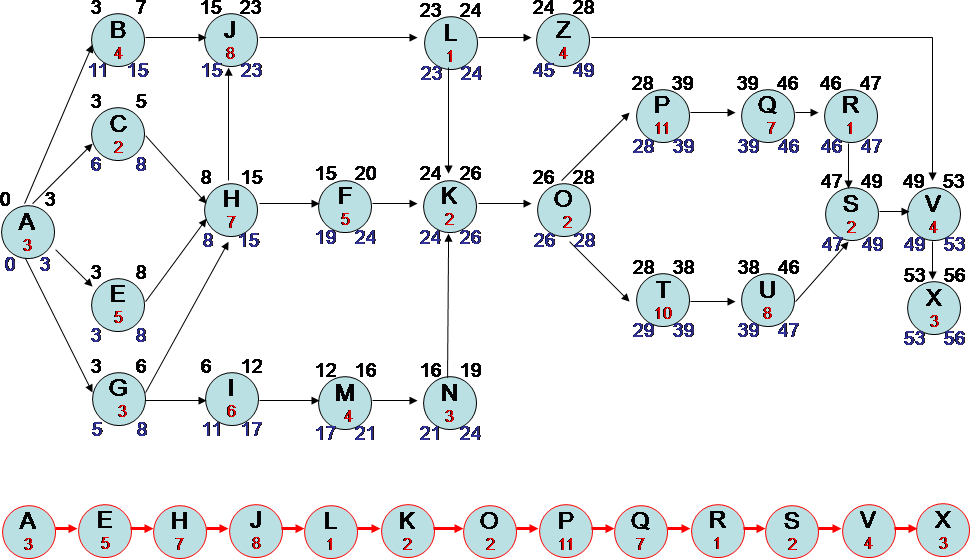
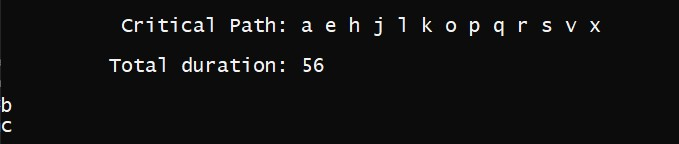

Лабораторна робота №4
===================
Виконала студентка групи ІП-81
Грибняк Єлизавета

----------
Виділення вершин мають ознаку не явної транзитності. (число вершин не менше 30).
-------------

Кожна вершина вихідного графу після аналізу маркується і їй
присвоюється ознака "транзитності" у відповідності з наступними визначеннями:
Резидентна вершина - вершина Vr належить до певного Uk рівню і переміщення її на інший рівень веде до зміни критичного шляху TCR.
Транзитна вершина – вершина V tr має свободу вибору рівня без зміни критичного шляху
TCR.
Транзитна вершина може належати трьом категоріям:
1. "явна транзитність" - зміна рівня приналежності вершини не збільшує критичний шлях;
2. "неявна транзитність" - склеювання (кластеризація) вершин цієї категорії на одному рівні не збільшує критичний шлях;
3. "мультиплікативна транзитність" - склеювання (кластеризація) вершин цієї категорії не збільшує критичний шлях, при цьому вершини належать різним рівням.

----------
Виконання
-------------------
Отже, наша програма має склеювати вершини на одному рівні, так, що критичний шлях не змінювався.
Візьмемо граф зображений на малюнку, та його критичний шлях:

В результаті виконання отримаємо такі вершини, що можна об'єднати без зміни шляху:

Отже, можемо обєднати такі вершини : b і c без зміни критичного шляху.
